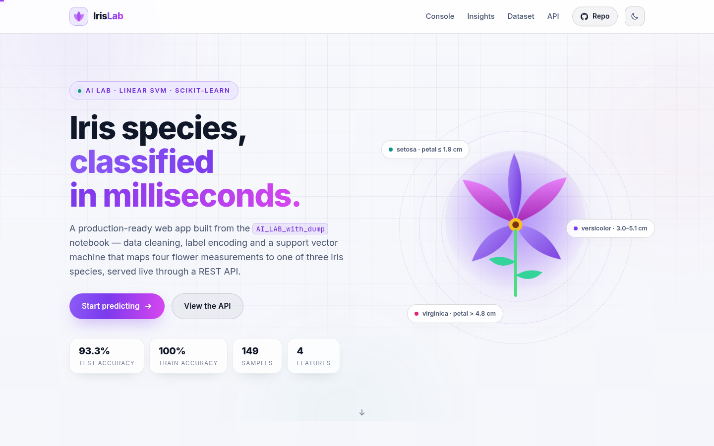
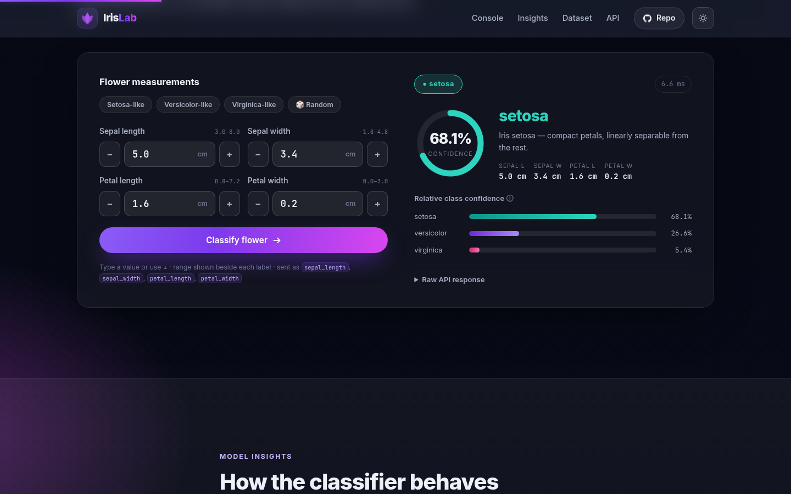
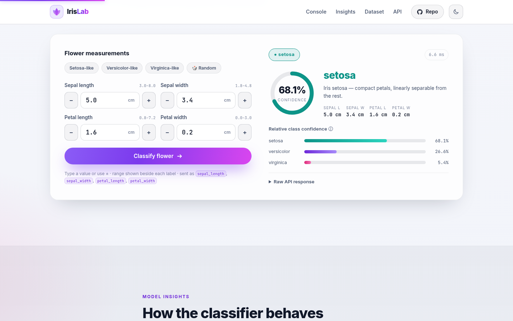
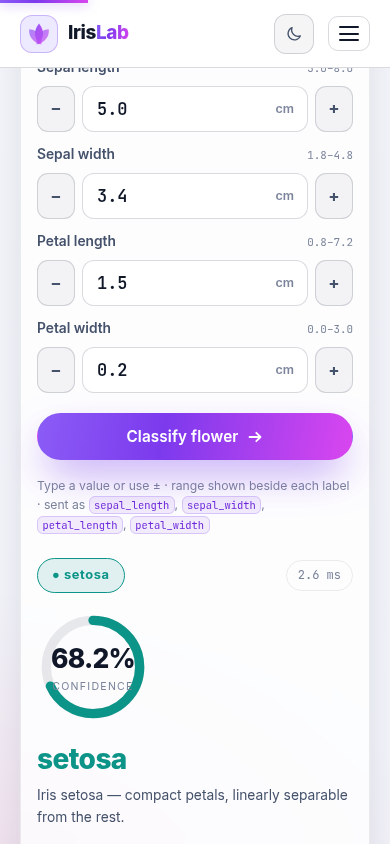

# 🌸 IrisLab — Iris Species Classifier Web App

A production-ready, fully responsive web application built from the
[`AI_LAB_with_dump.ipynb`](notebooks/AI_LAB_with_dump.ipynb) AI Lab notebook.
The notebook's trained **linear SVM** classifies iris flowers into
*setosa*, *versicolor* or *virginica* from four measurements — and this repo
serves that exact model behind a polished light-first UI (with dark mode) and a
clean JSON API.



Dark mode is one click away — the sun/moon toggle in the navbar:



| Prediction console | Mobile |
|---|---|
|  |  |

---

## ✨ Features

- **Light theme by default** with a persisted **light/dark toggle** — charts swap
  to a matching variant per theme (both generated from the saved model).
- **Numeric input boxes** — type a measurement or tap the ± steppers; valid
  ranges are shown beside each label and values are clamped automatically.
  Press **Enter** in any box to classify instantly.
- **Species presets** — Setosa-like / Versicolor-like / Virginica-like / Random
  fill all four boxes in one tap.
- **Animated results** — confidence donut, per-class confidence bars, latency
  chip and the raw API response in a collapsible JSON view; the result card is
  colour-themed per predicted species.
- **Model insights** — confusion matrix, feature distributions and SVM decision
  regions, all regenerated from the saved `iris_model.pkl` and the notebook's
  exact data pipeline.
- **Responsive by design** — mobile-first layout with a hamburger nav, fluid
  typography (`clamp()`), reduced-motion support and no CSS framework.
- **Clean REST API** — `POST /api/predict` with input validation, softmax
  confidence over the SVM's decision scores, latency reporting and a legacy
  `POST /predict` alias kept for notebook compatibility.
- **One-click Render deploy** — `render.yaml`, `Procfile`, `runtime.txt` and
  pinned `requirements.txt` are all included.

## 🗂 Project structure

```
iris-ml-webapp/
├── app.py                          # Flask app: frontend + JSON API
├── model/
│   ├── iris_model.pkl              # linear SVC saved by the notebook (joblib)
│   ├── label_encoder.pkl           # fitted LabelEncoder for species names
│   └── model_metadata.json         # feature names, target names, accuracy
├── templates/index.html            # single-page responsive frontend
├── static/
│   ├── css/style.css               # design system (light-first + dark mode)
│   ├── js/app.js                   # numeric input boxes, presets, fetch, animations
│   └── images/                     # charts generated from the saved model
├── notebooks/
│   ├── AI_LAB_with_dump.ipynb      # original lab notebook, as authored
│   └── AI_LAB_with_dump_executed.ipynb  # notebook executed end-to-end
├── docs/screenshots/               # UI screenshots used in this README
├── requirements.txt
├── render.yaml                     # Render blueprint (auto-deploy ready)
├── Procfile                        # gunicorn start command
├── runtime.txt                     # Python 3.12.14
└── README.md
```

## 🚀 Run locally

```bash
# 1. clone
git clone https://github.com/mythos0/iris-ml-webapp.git
cd iris-ml-webapp

# 2. create a virtual environment (Python 3.10+)
python -m venv .venv
source .venv/bin/activate        # Windows: .venv\Scripts\activate

# 3. install dependencies
pip install -r requirements.txt

# 4. run
python app.py                    # respects $PORT, defaults to 5000
```

Open http://localhost:5000, type your measurements and classify.

> 🎨 The site renders in **light mode — always the default**, even on devices
> with a dark OS colour scheme. The navbar toggle switches to dark and an
> explicit choice is remembered in `localStorage`.

## 🔌 API reference

| Method | Endpoint | Description |
|---|---|---|
| `GET`  | `/api/health`     | Service + model status |
| `GET`  | `/api/model-info` | Feature names, classes, test accuracy |
| `POST` | `/api/predict`    | Classify one flower |
| `POST` | `/predict`        | Legacy alias (notebook-compatible) |

**Request**

```bash
curl -X POST https://YOUR-APP.onrender.com/api/predict \
  -H "Content-Type: application/json" \
  -d '{"sepal_length": 5.1, "sepal_width": 3.5, "petal_length": 1.4, "petal_width": 0.2}'
```

Fields accept snake_case (`sepal_length`) or camelCase (`sepalLength`) and are
validated against physically plausible ranges (e.g. sepals 0.5–10 cm).

**Response**

```json
{
  "prediction": "setosa",
  "prediction_index": 0,
  "confidence": 0.6826,
  "confidence_scores": {
    "setosa": 0.6826,
    "versicolor": 0.2642,
    "virginica": 0.0532
  },
  "decision_scores": {
    "setosa": 2.2463,
    "versicolor": 1.2971,
    "virginica": -0.3056
  },
  "input": {
    "sepal_length": 5.1,
    "sepal_width": 3.5,
    "petal_length": 1.4,
    "petal_width": 0.2
  },
  "latency_ms": 2.84
}
```

> ℹ️ The linear SVC is trained with `probability=False`, so the "confidence"
> figures are a **softmax over the decision-function scores** — an intuitive
> relative signal, not a calibrated probability.

## 🧪 Model card

| | |
|---|---|
| **Model** | `sklearn.svm.SVC`, linear kernel |
| **Training data** | Fisher's Iris dataset — 149 samples after cleaning |
| **Cleaning** | Synthetic NaNs repaired with column means; 1 row dropped (missing label) |
| **Split** | 80 / 20, `random_state=42` (119 train / 30 test) |
| **Encoding** | `LabelEncoder` → setosa, versicolor, virginica |
| **Test accuracy** | **93.33%** (28/30) |
| **Train accuracy** | 100% |
| **Misclassified** | 2 versicolor → virginica |

## 📓 About the notebook

`notebooks/AI_LAB_with_dump_executed.ipynb` contains the notebook **executed
end-to-end** with all outputs — model artifacts, `app.py`, `requirements.txt`
and `render.yaml` it generates via `%%writefile` are exactly what this web
application builds on.

One automation tweak: the manual-input cell keeps `input()` for interactive
runs but falls back to demo values (`5.9, 3.0, 4.3, 1.5`) when stdin is
unavailable (headless execution with `jupyter nbconvert --execute`), so the
notebook is CI/reproducibility friendly.

## ☁️ Deploy to Render

1. **Push this repo to GitHub** (or fork it to your account).
2. In [Render](https://dashboard.render.com) choose **New → Web Service** and
   connect the repository.
3. Render detects `render.yaml` automatically:
   - **Build:** `pip install -r requirements.txt`
   - **Start:** `gunicorn app:app --bind 0.0.0.0:$PORT --workers 2 --threads 4`
   - **Health check:** `/api/health`
   - **Python:** 3.12.14 (`PYTHON_VERSION` env var + `runtime.txt`)
4. Click **Apply** — every push to `main` triggers an automatic redeploy.

> ⚠️ The original notebook's `render.yaml` used a bare `gunicorn app:app`
> start command, which ignores Render's `$PORT` and fails health checks.
> This repo binds gunicorn to `0.0.0.0:$PORT` explicitly — keep that when
> editing the blueprint.

**Free-tier note:** Render free web services sleep after ~15 minutes of
inactivity; the first request afterwards may take ~30–60 s while the service
spins back up.

## 🧰 Tech stack

Flask · Gunicorn · scikit-learn (SVC) · joblib · pandas · NumPy ·
vanilla JS · hand-rolled CSS design system · matplotlib/seaborn (figures) ·
Render

## 📄 License

MIT — use it, fork it, deploy it.
